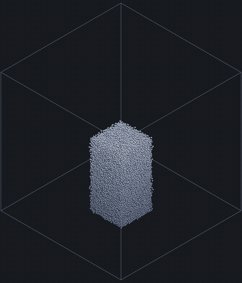
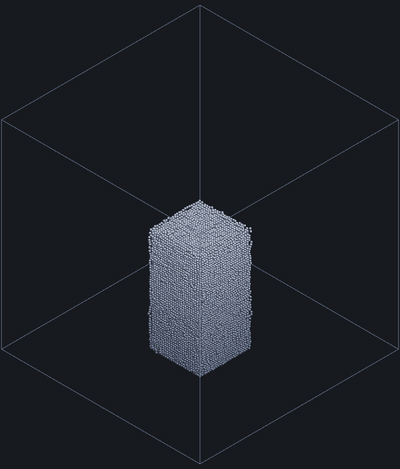
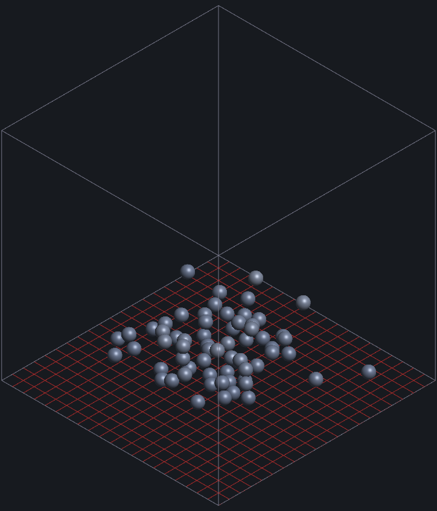
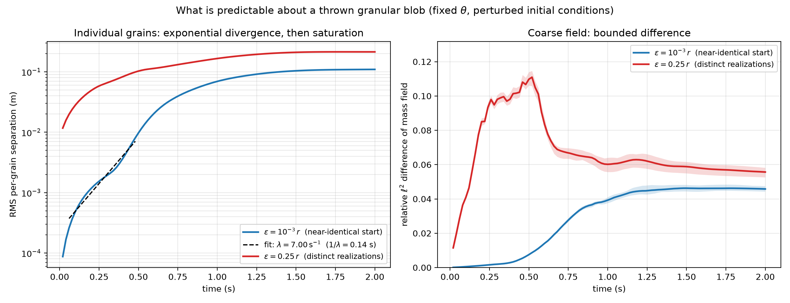
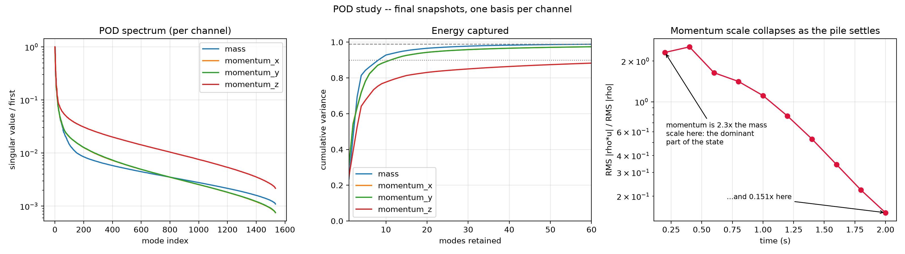
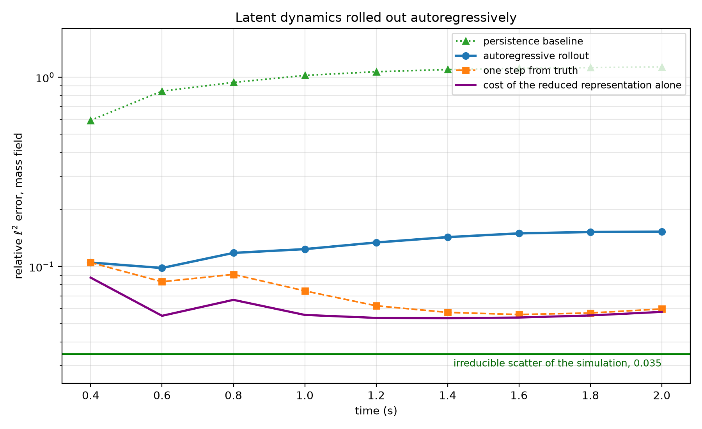
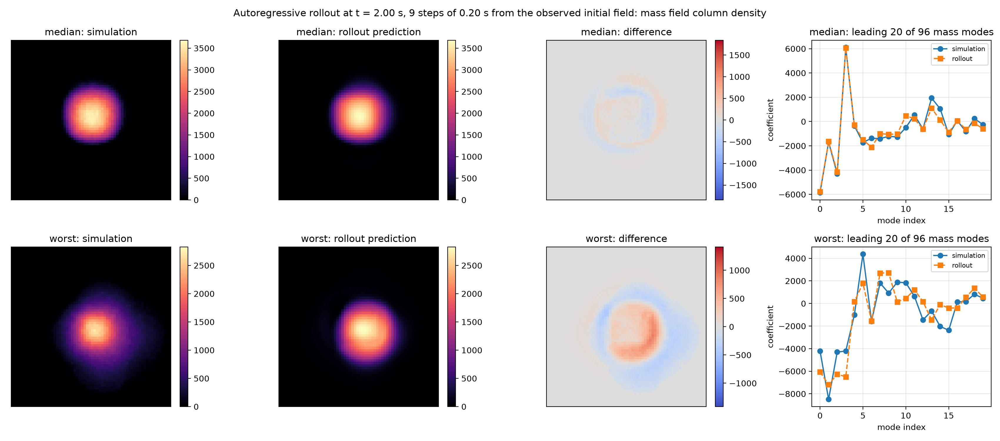
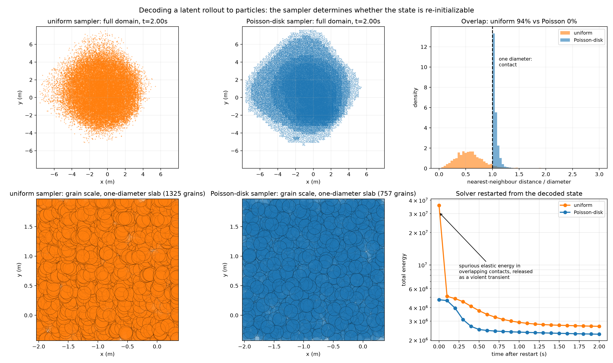
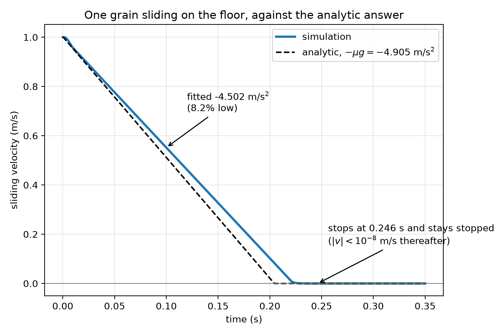

# world

A world model trained on a dynamics simulation of granular material, together with the
simulation that produced it. The simulation advances 32,768 interacting grains faster than
real time on one GPU, streams its complete state to a browser, and visualizes it instantly
with no post-processing step. The world model observes a coarse field of that state, predicts
the next one, rolls itself forward, and decodes the result back into particles the solver will
accept. This project integrates both halves: the dynamics simulation that a learned model is
usually asked to stand in for, and the learned model itself, scored against the real answer on
held-out trajectories.
Because chaos puts a floor under any prediction of this material, that floor is measured here
too, and the model is reported against it.

<div align="center">
  
  
</div>

<p align="center"><em>
Collapse of a granular column of 32,500 grains, aspect ratio near 4, released from rest and
recorded live from the browser client. The two runs differ in one configuration value, the
Coulomb friction coefficient. Left, <code>friction: 0.0</code>: the material carries no yield
stress and spreads until it reaches the side walls. Right, <code>friction: 0.5</code>,
representative of dry sand: the front arrests at a median radius of 0.55 m against 0.87 m, and
the deposit is 0.043 m deep at its median against 0.026 m. Real time, 25 frames per second.
Configurations <code>demos/fluid.yaml</code> and <code>demos/sand.yaml</code>, measured with
<code>scripts/measure_deposit.cjs</code>. The frictionless deposit reaches the side walls, so
the domain and not the material sets where its front stops.
</em></p>

---

## 1. Introduction

An agent that learns by acting needs a model of the environment it acts in, and two families of
such models are being built. The first predicts observations directly. Given a text prompt and
a stream of control inputs, Genie 3 generates a navigable environment at 24 frames per second
and 720p resolution, and holds it consistent for several minutes [[1]](#ref1), and the Cosmos
platform packages world foundation models of the same class for robotics and driving
[[2]](#ref2). The appeal is that the environment is authored by a prompt, without an artist.
The difficulty is physical fidelity. Kang et al. [[3]](#ref3) trained video models on data
generated by classical mechanics and found perfect generalization within the training
distribution and failure outside it, the models reproducing the nearest training example in
place of the underlying law. Motamed et al. [[4]](#ref4) evaluated six current video models on
396 real videos spanning fluid dynamics, optics, solid mechanics, magnetism, and thermodynamics
and reported that physical understanding is severely limited and uncorrelated with visual
realism. Nothing in these architectures enforces conservation of mass, momentum, or energy, and
no reference trajectory exists against which a rollout could be scored.

The second family predicts state, using a solver. MuJoCo [[5]](#ref5), Isaac Lab [[6]](#ref6),
and Newton [[7]](#ref7) provide exact dynamics, complete state, arbitrary intervention, and
reproducible resets, at the cost of an environment that has to be authored by hand. Between the
two sits the learned surrogate trained on solver output: graph network simulators of this kind
reproduce sand, water, and deformable solids at orders of magnitude less cost than the solver
that generated their training data [[8]](#ref8), at the price of long-horizon drift and
conservation error.

Particles are where the two families are converging. Three-dimensional Gaussian splatting
[[9]](#ref9) represents a scene by a set of anisotropic primitives, and those primitives are
particle-like, which PhysGaussian [[10]](#ref10) exploits to advance a reconstructed scene with
material point dynamics using one discretization for both simulation and rendering. A contact
solver, a neighbor search, and a time integrator are what such a pipeline needs, and they are
what the solver half of this repository provides.

Granular material is the interesting test case, for two reasons. Its dynamics are non-smooth,
since contacts open and close and the tangential force is capped at the Coulomb limit, and they
are chaotic, in the sense that velocity fluctuations in quasistatic granular flow carry the
scaling characteristics of fluid turbulence [[11]](#ref11). Individual grain trajectories are
therefore unpredictable beyond a short horizon, while bulk quantities such as the distance the
front travels are reproducible enough to have been correlated against laboratory experiment
[[12]](#ref12), [[13]](#ref13). Section [4](#4-what-is-predictable) measures the gap between
those two statements, and Section [5](#5-the-world-model) builds the model that gap permits.

The formal specification of the encoder, the reduction, and the regression, with every symbol and
dimension defined, is `surrogate/formulation.tex`, and that document is the authority for the
method.

## 2. Results at a glance

| | |
|---|---|
| **Solver** | |
| grains advanced faster than real time, one RTX 2080 | 32,768 at 1.95x |
| cost per step at that operating point | 0.514 ms |
| front radius against the laboratory correlation of Lube et al. | 13 to 19 percent short |
| sliding friction against the analytic answer | -4.50 m/s^2 against -4.905 |
| **Chaos** | |
| amplification of a 50 micron perturbation of every grain | 2191x, to 1.10 grain diameters |
| per-grain predictability horizon | 1.38 s |
| coarse-field difference over the same interval | 0.046 |
| irreducible scatter of the coarse field about its mean | 0.0345 |
| **World model** | |
| autoregressive rollout error at t = 2.0 s, held out | 0.153, i.e. 4.4x the scatter |
| against a persistence baseline | 1.132 |
| cost of the reduced representation alone | 0.058 |
| overlapping grain pairs in the decoded state | 0 percent |

## 3. The solver

The state is a flat device array of `[x, y, z, vx, vy, vz]` per particle, with z up and gravity
along the negative z axis, and each particle carries a material identifier that indexes a table
of masses. Neighbors come from a uniform grid of about one particle diameter per cell,
compacted so that its storage grows with the number of particles and not with the number of
cells, and a cell over its capacity drops the excess from that step rather than corrupting
memory. Time integration is semi-implicit Euler.

<div align="center">
  
</div>

<p align="center"><em>
Sixty-four coarse grains at rest, with the neighbor grid drawn on the floor plane. Each grain is
one instanced camera-facing quad; the sphere, its shading, and its depth are reconstructed in the
fragment shader, so no geometry is generated per frame at any particle count. Configuration
<code>demos/grain_detail.yaml</code>.
</em></p>

The normal contact force is a linear spring with a clamp, in parallel with a linear dashpot
acting only while the particles overlap, which is the spring and dashpot model of Cundall and
Strack [[14]](#ref14). The dashpot coefficient is not a free parameter: it follows from a target
coefficient of restitution through the standard relation [[15]](#ref15), [[16]](#ref16), using
the two-body reduced mass for grain to grain contacts and the infinite-mass limit for walls, and
it acts on the normal component of the relative velocity alone. The tangential force opposes the
remaining component and is capped at the friction coefficient times the magnitude of the normal
force, which is what gives the material a yield stress and therefore a finite angle of repose.
Total energy is available as a diagnostic, summing kinetic, gravitational, and contact elastic
contributions; the elastic term is piecewise, quadratic until the force clamp engages and linear
after it.

The simulation serves state over a WebSocket, and the browser client renders the positions it
receives directly, in real time. Every physical and
numerical quantity is read from a configuration file, so changing a material
property or an initialization only requires editing a text file.

## 4. What is predictable

Fix the parameters of a throw and evolve an ensemble whose members differ only by a random
displacement of every grain's initial position, drawn from an independent random stream so that
the base packing stays identical across members.

<div align="center">
  
</div>

<p align="center"><em>
Left, the root mean square separation of corresponding grains for two perturbation amplitudes.
Right, the relative difference of the coarse mass field for the same two ensembles. Produced by
<code>build/bin/chaos</code> and <code>surrogate/plot_chaos.py</code>.
</em></p>

At a perturbation of one thousandth of a grain radius, 50 microns, the root mean square
per-grain separation grows from 8.7e-5 m to 1.10e-1 m, an amplification of 2191, and reaches 90
percent of that plateau at t = 1.38 s. That time is the per-grain predictability horizon.

The growth is not a single exponential, and quoting one rate for it would misrepresent the
measurement. The local rate `d(ln D)/dt` is 19.7 per second over [0.02, 0.10] s while the
contact network rearranges, settles to 6.0 to 6.5 per second over [0.10, 0.80] s, and collapses
to 1.3 and then 0.13 per second after that. The sustained value is the one to quote. Saturation
is caused by jamming: growth stops when the deposit settles and friction locks the packing,
which is why the plateau sits at 1.10 grain diameters and not at the scale of the assembly.

Over the same interval, and past the point at which the per-grain separation has saturated, the
coarse mass fields of two ensemble members differ by 0.046 and their centers of mass by 0.011 of
a grid node. The distance between the two panels is the whole argument for predicting a coarse
field instead of a trajectory: chaos destroys the estimator and leaves the quantity intact.

The same ensemble supplies the number a model has to be judged against. At a perturbation of a
quarter of a grain radius the members are distinct realizations of one macroscopic state, and
the root mean square deviation of a realization about the ensemble mean is 0.0345 for the
parameter box, latent resolution, and horizon used in Section [5](#5-the-world-model).

## 5. The world model

The model predicts one state of the material from the previous one, works in a compact
representation of the field instead of in grain coordinates, and is rolled forward from a single
observation of the initial state. It is built this way due to the results of Section [4](#4-what-is-predictable),
which show that grain coordinates are unknowable past 1.38 s, whereas the coarse field is still predictable.

The state the model works in is a coarse field with four channels, mass density and the three
components of momentum density, deposited from the particles onto a grid of 64 by 64 by 16
nodes, coarser along z because the outcome is a thin layer, by the trilinear, or cloud-in-cell,
weights [[17]](#ref17) that the material point method uses for its particle to grid transfer
[[18]](#ref18). The momentum channels are not optional: two piles of identical shape and
different velocity fields evolve differently, so a mass field alone is not a Markov state. This method of transferring the particles to the grid is continuous in particle position, unlike nearest-node
binning, and the discontinuity that binning would introduce at every cell crossing would
enter the regression target as noise. Out-of-range indices are clamped, so the eight weights
always sum to one and total mass is conserved exactly. Encoding each
32,768-grain state onto the 32 by 32 by 32 latent of the interactive configuration costs .03 ms.

That field is reduced by a proper orthogonal decomposition (POD), computed by
singular value decomposition (SVD) of the centered snapshot matrix, with one
basis per channel. A joint basis would require the four channels to be scaled
against one another. While this is possible, that scaling can be considered
questionable, due to the fact that mass density is positive definite while
momentum density is signed, and the dynamic range of momentum is both wider and
more scenario-dependent, so whichever channel were scaled larger would dominate
the spectrum and the reported energy captured would have less meaning.

<div align="center">
  
</div>

<p align="center"><em>
Left and center, the spectrum and cumulative captured variance for each of the four channels of
the settled field. Right, the ratio of momentum scale to mass scale against time. Produced by
<code>surrogate/pod_study.py</code>.
</em></p>

While the material is moving, momentum is about as representable as mass: at rank 24 the
held-out reconstruction error at t = 0.2 s is 0.040 for a momentum channel against 0.028 for
mass. Once the deposit has settled the two diverge, 0.185 against 0.075, because what remains of
the momentum field is slow creep with little spatial structure for a low-rank basis to hold.

### 5.1 Rolling the model forward

The model maps the current reduced state and the three material parameters to the reduced state
one interval of 0.20 s later, through one Gaussian process (GP) regression [[19]](#ref19) per
latent coordinate, and is then fed its own output. It is fitted on 1416 rollouts and evaluated
on 120 held out; the split is by rollout and never by transition, since consecutive transitions
from one rollout are strongly correlated and splitting them at random leaks a test rollout's own
trajectory into training.

<div align="center">
  
</div>

<p align="center"><em>
Field error against horizon for 120 held-out rollouts, started from the observed initial field.
The green line is the irreducible scatter measured in Section
<a href="#4-what-is-predictable">4</a> for this configuration, which is the reference the
rollout has to be read against. Produced by <code>surrogate/plot_rollout.py</code>.
</em></p>

| at t = 2.0 s, mass field, held out | relative error |
|---|---|
| cost of the reduced representation alone | 0.058 |
| one step from truth | 0.060 |
| autoregressive rollout | 0.153 |
| persistence baseline | 1.132 |
| irreducible scatter of the simulation | 0.0345 |

The rollout sits at 4.4 times the irreducible scatter, nine autoregressive steps out, against a
persistence baseline of 1.132. The scatter itself is the root mean square deviation of a
realization about the ensemble mean. The value is specific to a configuration and a horizon, so
`surrogate/fit_dynamics.py` takes it as an argument rather than hardcoding one.

Decomposing the error into three separately measurable terms is valuable,
because which term dominates changes the answer to the question of what to fix. Truncation
follows from encoding the truth and decoding it and is independent of the regressor. One-step
error is the error from propagating the model by one step, then subtracting the truncation
error. The compounding error is the rollout error minus the error from propagating one step.
Therefore, this provides a clear path for model improvement:
  - if truncation error is large, increase the number of POD modes. More training data does nothing.
  - if one-step error is large, improve the regressor, add training data.
  - if the compounding error is large, the model is drifting off-distribution.
    Fixes are fewer steps for the same horizon (a larger interval), a training
    objective defined over multiple steps, or noise injection during fitting.

The rollout error grows monotonically with horizon, since compounding accumulates, and it is
compounding that dominates: 0.093 of the 0.153 total at t = 2.0 s, against 0.058 for truncation
and 0.002 for the one-step regressor. The one-step error does peak early and then fall, 0.105 at
t = 0.4 s down to 0.060 at t = 2.0 s, due to the fact that impact and spreading is
the hardest part of the trajectory to predict, and the deposit settles afterwards.

<div align="center">
  
</div>

<p align="center"><em>
The rollout decoded back to the mass field at t = 2.0 s, nine steps from the observed initial
field, for the median and the worst of the 120 held-out rollouts. An error number says how wrong
the model is; this says how it is wrong. The median is visually indistinguishable from the
simulation. The worst case predicts a round pile where the simulation produced a more diffuse
deposit, which the difference panel shows as a positive core inside a negative annulus.
Produced by <code>surrogate/plot_rollout.py</code>.
</em></p>

### 5.2 Decoding back to particles

Depositing particles onto a grid is many-to-one, so a predicted field is consistent with
infinitely many particle configurations and the inverse direction is a sampler.
`surrogate/decode_particles.py` clamps negative densities, rescales to the exactly known total
mass, draws node indices with probability proportional to nodal mass, places positions inside
the selected cell, and recovers velocities by interpolating momentum and mass at the sampled
position with the deposit weights. Decoding an encoding therefore reproduces the field, not the
configuration.

<div align="center">
  
</div>

<p align="center"><em>
Top row, the sampled configuration at t = 2.0 s and the distribution of nearest-neighbor
distances in units of a grain diameter. Bottom row, the same configurations at grain scale and
the total energy after the solver is restarted from each. Produced by
<code>surrogate/plot_decode_comparison.py</code>.
</em></p>

Whether the decoded state can be handed back to the solver is decided by the sampler, and the
figure measures it. Node spacing is 3.17 grain diameters and about twelve grains share a node,
so placing them uniformly inside a cell leaves 94 percent of grains closer than one diameter to
a neighbor; the spurious elastic energy stored in those overlaps gives an initial total of
3.59e7, of which 86 percent discharges within the first 0.1 s as a violent transient. Dart
throwing against the density field, which is the minimum-separation construction of Bridson
[[20]](#ref20) with a prescribed density in place of a uniform one, leaves no overlapping pairs,
a median nearest-neighbor distance of 1.03 diameters, an initial energy of 4.75e6, and a decay
that loses only 1.9 percent over the first 0.1 s. The solver reads such a state back from a
file, which closes the loop from simulation to field to prediction to simulation.

The separation is not free, and at this grain count the price is visible. The sampler cannot
exceed the local packing limit, so where the predicted field asks for more density than
physically fits it displaces grains outward and, in the middle of the trajectory, cannot place
all of them, limited to 27,091 of 32,000 at t = 0.6 s, recovering to all 32,000 once the deposit spreads.
A field that demands density above the packing limit is locally unphysical, so a shortfall is
information rather than a defect, which is why placed and requested are both reported. The
minimum separation placement incurs some error, seen at t = 2.0 s where the error in the centroid is 0.026 m for uniform placement
against 0.203 m for minimum separation. Uniform placement is therefore the one to use for
visualization and bulk statistics, and minimum separation whenever the state has to be
integrated.

Nodes below two percent of peak density have to be discarded
and the remainder renormalized, because a truncated reduction leaves a diffuse halo of grains
where the density is near zero, at which point dividing momentum by mass assigns them enormous
velocities. At t = 2.0 s the threshold takes the error in the spatial standard deviation from
0.079 m to 0.045 m and the sampled kinetic energy from 53,314 to 10,739 against a true value of
6,480.

## 6. Performance

Real time is treated as a hard constraint on the solver, so the figure reported here is the
number of grains that can be advanced at one second of simulated time per second of wall clock,
in preference to the number that fit in memory. On one GeForce RTX 2080 with the configuration in
`config.yaml`, at a timestep of 1e-3 s and 32,768 grains, the solver costs 0.514 ms per step and
therefore runs at 1.95 times real time. Averaged over three runs whose spread is below two
percent, per 100 steps:

| stage | ms per 100 steps | percent of solver time |
|---|---|---|
| neighbor search | 35.8 | 70 |
| contact forces | 14.6 | 28 |
| time integration | 1.03 | 2 |

Reproduce with `make profile && ./build/bin/profile`. Trading real time away, the same solver
reaches 343,000 grains at 0.12 times real time.

Two results here only appear if the timings are measured. Raising the per-cell capacity of the
neighbor grid from 8 to 512, a change that leaves correctness and the actual neighbor counts
identical, roughly doubled the cost of both the neighbor search and the force evaluation,
because the fixed row stride of the neighbor array grows with it, pushing the rows of adjacent
particles apart in memory and breaking coalesced access. Padding a capacity parameter for safety
cost a factor of two in throughput for nothing. Separately, scaling in three dimensions is
superlinear: 4.6 times the grains, from 19,700 to 91,000, costs 12.6 times the time, because the
neighbor array overruns the 4 MB last-level cache of this GPU. The bottleneck is memory traffic,
with arithmetic to spare, which is where the next optimization belongs.

It is worth being transparent about how modest the speedup over the solver is. One
autoregressive step advances 0.20 s of simulated time and costs 44 ms for a single trajectory,
or 11.2 ms per trajectory in a batch of 120, against 123 ms for the solver to cover the same
interval for the same 32,000 grains. That is 2.8x unbatched and 11x batched, where a learned
surrogate is usually expected to buy orders of magnitude. This cost is due to the exact GP
inference over 900 training points and 168 outputs. One advantage however is that the cost is
independent of both grain count and timestep, while the solver cost grows with each, so the
comparison moves in the model's favor as the simulation gets harder.

## 7. Verification and validation

So far, eleven unit tests construct the simulation directly and cover the deposit properties of
Section [5](#5-the-world-model), mass conservation of the deposit for a disordered configuration
in flight, the neighbor grid's over-capacity path, and the monotonicity of the total energy.

Another useful physical test is sliding friction against the analytic answer. A single grain in sustained contact with the floor
must decelerate at exactly the friction coefficient times gravity, which makes one grain the
right place to verify the tangential model.

<div align="center">
  
</div>

<p align="center"><em>
<code>model_problems/sliding_friction.yaml</code>, plotted by
<code>surrogate/plot_friction_validation.py</code>.
</em></p>

The fitted deceleration is -4.50 m/s^2 against the ideal -4.905 m/s^2, a deficit of 8.2 percent,
after which the grain stops at 1e-8 m/s and stays stopped. The cause lies outside the friction
model, in float32 precision: `x += dt*v` leaves the position unchanged once `dt*|v|` drops below
half a unit in the last place of `x`, so a resting grain keeps a small downward velocity whose
dashpot force permanently carries part of the load. The measured shortfall in the normal force
accounts for the friction deficit exactly, and reducing the timestep makes it worse.

Another important test for a solver is to compare against experimental results. To do this,
the front radius is compared against a laboratory experiment. Lube et al. [[12]](#ref12) correlated the final
radius of an axisymmetric granular column collapse as `R_inf/R_0 = 1 + 1.8 a^(1/2)` for aspect
ratios above 2, where `a` is the ratio of initial height to initial radius. The column of
`demos/sand.yaml` stands 1.05 m tall on a square footprint of side 0.505 m, an aspect ratio
between 3.69 and 4.16 according to whether the equivalent initial radius of a square column
preserves area or is taken as half the side, and therefore a predicted final radius between
1.27 m and 1.18 m. Re-run in a domain wide enough that the front is set by the material alone,
the measured front reaches 1.03 m, 13 to 19 percent short of the correlation. Two known
deficiencies bear on a gap of that size: the column is only 25 grains across, far from the
continuum limit of experiments whose ratio of column size to grain size is one to two orders of
magnitude larger, and the spheres carry no rolling resistance. The comparison is offered as a
scaling check, not as a calibration.

Finally, the stability is quantified. A sweep of the timestep against the contact stiffness, each combination
isolated so that a diverging run cannot terminate the sweep, maps which combinations are stable.
The requirement is at least about 20 steps per contact period `2 pi sqrt(m_reduced/k)`, below
roughly 5 of which nothing works. The stability binary numerically confirms the
valid stable choices of the timestep.

## 8. Build and run

The solver requires CUDA and an NVIDIA GPU. `make` detects the CUDA installation and the GPU
architecture and clones the missing dependencies into `external/` on the first build.

```
make                                    # build/bin/world, the streaming simulation server
./build/bin/world demos/sand.yaml       # listens on :8081
cd client && npm install && node index.js local     # :8080, no build step
```

Then open `http://localhost:8080`. Other targets are `make profile` for the timings of Section
[6](#6-performance), `make stability` for the sweep, `make model_problem` for single collisions,
`make dataset` for the training set, `make chaos` for the ensemble of Section
[4](#4-what-is-predictable), and `make test`.

The analysis tooling is Python and lives behind a virtual environment:

```
python3 -m venv surrogate/.venv
surrogate/.venv/bin/pip install -r surrogate/requirements.txt
surrogate/.venv/bin/python surrogate/make_design.py --rollouts 8 --out dataset/design_smoke.csv
./build/bin/dataset dataset/blob_throw.yaml dataset/design_smoke.csv
surrogate/.venv/bin/python surrogate/dataset_io.py
```

The deposited mass per checkpoint should equal the grain count times the grain mass to about
1e-7 in relative terms for every rollout, which validates the binary layout and the mass
conservation of the deposit at the same time.

Every figure and animation above is reproducible. `scripts/capture_gif.cjs` and
`scripts/capture_screenshot.cjs` drive the real browser client headlessly, gating its request
loop so that the capture advances the simulation one frame at a time.
`scripts/measure_deposit.cjs` speaks the binary protocol directly and reduces the final
positions to the front radii quoted above.

## 9. Limitations

1. Worlds are authored by hand in a configuration file. This is the substantive objection to a
   simulator used as a world model, since removing exactly this authoring cost is the economic
   argument for the generative alternative [[1]](#ref1). Of course, since the
   input is just a text file, an LLM would be fully capable of authoring the
   worlds.
2. Material parameters cannot currently be inferred from data - they must be
   model inputs. However, comparisons against experiments would enable tuning
   these parameters to reality.
3. The code is not differentiable. The pathwise gradient of a
   chaotic system has variance that grows exponentially in the horizon [[21]](#ref21), and under
   stiff contact the pathwise estimator can be empirically biased and worse than a model-free
   alternative [[22]](#ref22); the contact model is also non-smooth independently of the chaos,
   since the force clamp zeroes the derivative exactly. Statistical observables are the
   differentiable objects here, as they are for adjoints of turbulent flows [[23]](#ref23), and
   zeroth-order estimation over parallel rollouts [[24]](#ref24) can be used to
   approximate the gradient.
4. One GPU, with no domain decomposition across devices.
5. When an impact is energetic enough to reach the force clamp, the achieved restitution falls
   measurably below the target, since the contact spends part of its duration in a constant-force
   regime that the restitution-to-damping derivation does not model.
6. There is no rolling resistance, so heaps settle at about 15 degrees where dry sand sits near
   30. This is the standard shortfall of an assembly of monodisperse spheres, and rolling
   resistance is the accepted remedy [[25]](#ref25), [[26]](#ref26). The friction that is present
   is also regularized, a viscous tangential force capped at the Coulomb limit and not a
   set-valued constraint, because the neighbor list is rebuilt every step and no per-contact
   tangential history survives to be integrated. It holds statically in practice, as Section
   [7](#7-verification-and-validation) reports, while remaining sliding friction without a true
   static threshold.

## References

<a id="ref1"></a>[1] Google DeepMind. *Genie 3: A new frontier for world models*, 2025.
[deepmind.google/blog/genie-3-a-new-frontier-for-world-models](https://deepmind.google/blog/genie-3-a-new-frontier-for-world-models/)

<a id="ref2"></a>[2] NVIDIA. *Cosmos World Foundation Model Platform for Physical AI*, 2025.
[arXiv:2501.03575](https://arxiv.org/abs/2501.03575)

<a id="ref3"></a>[3] B. Kang et al. *How Far is Video Generation from World Model: A Physical Law
Perspective*. ICML, 2025. [arXiv:2411.02385](https://arxiv.org/abs/2411.02385)

<a id="ref4"></a>[4] S. Motamed et al. *Do Generative Video Models Understand Physical
Principles?* WACV, 2026. [arXiv:2501.09038](https://arxiv.org/abs/2501.09038)

<a id="ref5"></a>[5] E. Todorov, T. Erez, Y. Tassa. *MuJoCo: A physics engine for model-based
control*. IROS, 2012.

<a id="ref6"></a>[6] M. Mittal et al. *Orbit: A unified simulation framework for interactive
robot learning environments*, the framework now published as Isaac Lab. IEEE Robotics and
Automation Letters, 2023. [arXiv:2301.04195](https://arxiv.org/abs/2301.04195)

<a id="ref7"></a>[7] NVIDIA, Google DeepMind, Disney Research. *Newton, an open-source physics
engine for robotics simulation*, 2025.
[developer.nvidia.com/newton-physics](https://developer.nvidia.com/newton-physics)

<a id="ref8"></a>[8] A. Sanchez-Gonzalez et al. *Learning to Simulate Complex Physics with Graph
Networks*. ICML, 2020. [arXiv:2002.09405](https://arxiv.org/abs/2002.09405)

<a id="ref9"></a>[9] B. Kerbl, G. Kopanas, T. Leimkühler, G. Drettakis. *3D Gaussian Splatting
for Real-Time Radiance Field Rendering*. ACM Transactions on Graphics, 2023.

<a id="ref10"></a>[10] T. Xie et al. *PhysGaussian: Physics-Integrated 3D Gaussians for
Generative Dynamics*. CVPR, 2024. [arXiv:2311.12198](https://arxiv.org/abs/2311.12198)

<a id="ref11"></a>[11] F. Radjai, S. Roux. *Turbulentlike Fluctuations in Quasistatic Flow of
Granular Media*. Physical Review Letters 89, 064302, 2002.

<a id="ref12"></a>[12] G. Lube, H. E. Huppert, R. S. J. Sparks, M. A. Hallworth. *Axisymmetric
collapses of granular columns*. Journal of Fluid Mechanics 508, 175-199, 2004.

<a id="ref13"></a>[13] E. Lajeunesse, A. Mangeney-Castelnau, J. P. Vilotte. *Spreading of a
granular mass on a horizontal plane*. Physics of Fluids 16(7), 2004.

<a id="ref14"></a>[14] P. A. Cundall, O. D. L. Strack. *A discrete numerical model for granular
assemblies*. Géotechnique 29(1), 47-65, 1979.

<a id="ref15"></a>[15] Y. Tsuji, T. Tanaka, T. Ishida. *Lagrangian numerical simulation of plug
flow of cohesionless particles in a horizontal pipe*. Powder Technology 71(3), 1992.

<a id="ref16"></a>[16] A. Di Renzo, F. P. Di Maio. *Comparison of contact-force models for the
simulation of collisions in DEM-based granular flow codes*. Chemical Engineering Science 59(3),
2004.

<a id="ref17"></a>[17] R. W. Hockney, J. W. Eastwood. *Computer Simulation Using Particles*. Adam
Hilger, 1988.

<a id="ref18"></a>[18] D. Sulsky, Z. Chen, H. L. Schreyer. *A particle method for
history-dependent materials*. Computer Methods in Applied Mechanics and Engineering 118, 1994.

<a id="ref19"></a>[19] C. E. Rasmussen, C. K. I. Williams. *Gaussian Processes for Machine
Learning*. MIT Press, 2006.

<a id="ref20"></a>[20] R. Bridson. *Fast Poisson disk sampling in arbitrary dimensions*. SIGGRAPH
Sketches, 2007.

<a id="ref21"></a>[21] L. Metz, C. D. Freeman, S. S. Schoenholz, T. Kachman. *Gradients Are Not
All You Need*, 2021. [arXiv:2111.05803](https://arxiv.org/abs/2111.05803)

<a id="ref22"></a>[22] H. J. T. Suh, M. Simchowitz, K. Zhang, R. Tedrake. *Do Differentiable
Simulators Give Better Policy Gradients?* ICML, 2022.
[arXiv:2202.00817](https://arxiv.org/abs/2202.00817)

<a id="ref23"></a>[23] Q. Wang, R. Hu, P. Blonigan. *Least squares shadowing sensitivity analysis
of chaotic limit cycle oscillations*. Journal of Computational Physics 267, 2014.

<a id="ref24"></a>[24] A. R. Conn, K. Scheinberg, L. N. Vicente. *Introduction to Derivative-Free
Optimization*. SIAM, 2009.

<a id="ref25"></a>[25] J. Ai, J.-F. Chen, J. M. Rotter, J. Y. Ooi. *Assessment of rolling
resistance models in discrete element simulations*. Powder Technology 206, 2011.

<a id="ref26"></a>[26] C. M. Wensrich, A. Katterfeld. *Rolling friction as a technique for
modelling particle shape in DEM*. Powder Technology 217, 2012.
