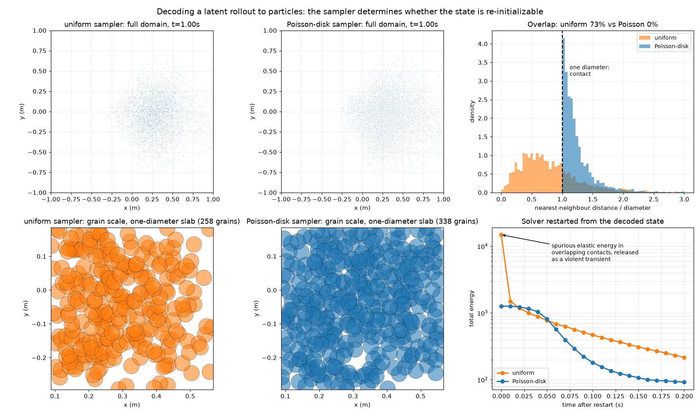
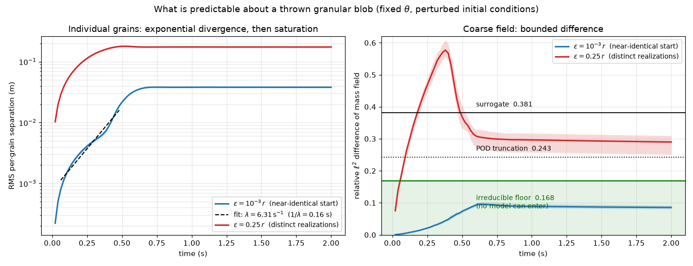
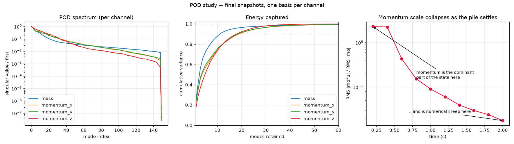
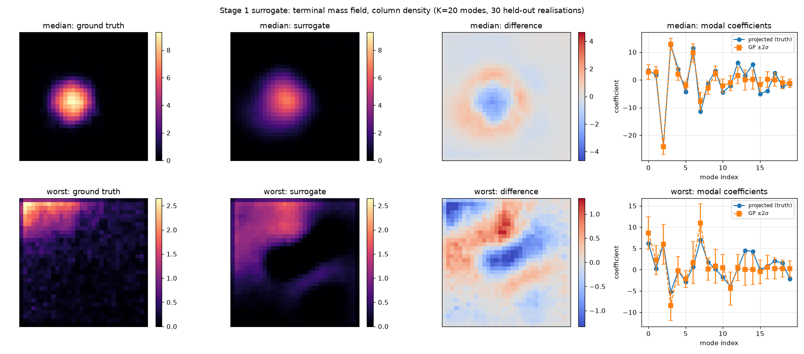
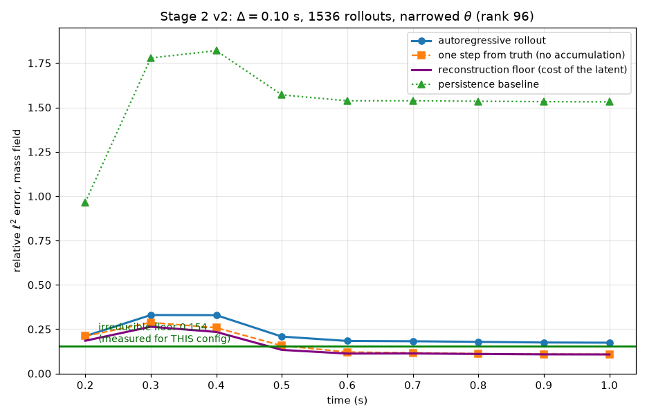

# world

A dynamics simulation of granular material that runs faster than real time on a single GPU,
streams its complete state to a browser, and is accompanied by a measurement of how much of
its outcome is predictable at all. The simulation supplies exact state, arbitrary
intervention and unlimited resettable rollouts; the measurement establishes the accuracy
that any predictive model of this system could reach, so that the accuracy of the learned
surrogate built on top of it has a denominator.

<div align="center">
  
  
</div>

<p align="center"><em>
Collapse of a granular column of 32,500 grains, aspect ratio near 4, released from rest and
recorded live from the browser client. The two runs differ in one configuration value, the
Coulomb friction coefficient. Left, <code>friction: 0.0</code>: the material carries no yield
stress, spreads until it reaches the side walls, and comes to rest one to two grains deep
across the whole floor. Right, <code>friction: 0.5</code>, representative of dry sand: the
front arrests at a median radius of 0.55 m against 0.87 m, and the deposit is 0.043 m deep at
its median against 0.026 m. Real time, 25 frames per second, 0.04 s of simulated time per
frame. Configurations <code>demos/fluid.yaml</code> and <code>demos/sand.yaml</code>; the
runout numbers were measured with <code>scripts/measure_deposit.cjs</code>. The frictionless
deposit reaches the side walls, so the domain and not the material sets where it stops.
</em></p>

---

## 1. Introduction

An agent that learns by acting needs a model of the environment it acts in, and two families
of such models are currently being built. The first predicts observations directly. Given a
text prompt and a stream of control inputs, Genie 3 generates a navigable environment at 24
frames per second and 720p resolution and holds it consistent for several minutes
[[1]](#ref1), and the Cosmos platform packages world foundation models of the same class for
robotics and driving [[2]](#ref2). The appeal of this family is that the environment is
authored by a prompt, without an artist. The difficulty is physical fidelity. Kang et al.
[[3]](#ref3) trained video models on data generated by classical mechanics and found perfect
generalization within the training distribution, measurable scaling for combinatorial
generalization, and failure out of distribution, the models reproducing the nearest training
example in place of the underlying law. Motamed et al. [[4]](#ref4) evaluated six current
video models on 396 real videos spanning fluid dynamics, optics, solid mechanics, magnetism
and thermodynamics, and reported that physical understanding is severely limited and
uncorrelated with visual realism. Nothing in these architectures enforces conservation of
mass, momentum or energy, and no reference trajectory exists against which a rollout could be
scored.

The second family predicts state, using a solver. MuJoCo [[5]](#ref5), Isaac Lab
[[6]](#ref6) and Newton [[7]](#ref7) provide exact dynamics, complete state, arbitrary
intervention and reproducible resets. Their cost is the inverse of the first family's: the
environment has to be authored by hand. Between the two sits the learned surrogate trained on
solver output. Graph network simulators of this kind reproduce sand, water and deformable
solids at orders of magnitude less cost than the solver that generated their training data
[[8]](#ref8), at the price of long-horizon drift, conservation error and poor extrapolation.

Particles are where the two families are converging. Three-dimensional Gaussian splatting
[[9]](#ref9) represents a scene by a set of anisotropic primitives, and those primitives are
particle-like, and PhysGaussian [[10]](#ref10) exploits that to advance a reconstructed
scene with material point dynamics using one discretization for both simulation and
rendering. A contact solver, a neighbor search and a time integrator are the components that
such a pipeline needs, and they are what this repository contains.

Granular material is the interesting test case for the question of what a world model of a
contact-rich system can know, for two reasons. Its dynamics are non-smooth, since contacts
open and close and the tangential force saturates at the Coulomb limit, and they are chaotic,
in the sense that velocity fluctuations in quasistatic granular flow carry the scaling
characteristics of fluid turbulence [[11]](#ref11). Individual grain trajectories are
therefore unpredictable beyond a short horizon, while bulk quantities such as runout distance
and deposit shape are reproducible enough to have been correlated against laboratory
experiment [[12]](#ref12), [[13]](#ref13). The distance between those two statements is
quantitative, and measuring it converts the design of a reduced model from a preference into
a consequence.

The objectives of the present work are as follows:

- Simulate granular material in three dimensions faster than real time on one GPU while
  exposing its complete state, so that the result is usable as an environment.
  Section [3](#3-the-simulator).
- Define a coarse field representation of the particle state that is closed-form and
  mass-conserving in both directions, so that a reduced model can be moved into and out of
  physical space without a learned encoder. Section [4](#4-the-latent-encoder-and-decoder).
- Measure the predictability horizon of the material directly, by evolving an ensemble whose
  members differ only by a perturbation of every grain's initial position, and measure
  separately the irreducible spread of the coarse field about its conditional mean. Section
  [5](#5-how-much-of-this-is-predictable).
- Fit a two-stage surrogate, from interaction parameters to the settled field and from the
  current reduced state to the next, and report its error against that measured spread.
  Section [6](#6-the-surrogate).

Sections [7](#7-performance) through [9](#9-build-and-run) report throughput, verification
and validation, and the build. Section [11](#11-limitations) states what the code cannot do.
The formal specification of the encoder, the reduction and the regression, with every symbol
and dimension defined, is `surrogate/formulation.tex`, and that document is the authority for
the method.

## 2. Summary of measured results

| quantity | value | where |
|---|---|---|
| grains stepped faster than real time, one RTX 2080 | 32,768 at 1.95x | [§7](#7-performance) |
| solver cost per step at that operating point | 0.514 ms | [§7](#7-performance) |
| encode of the full particle state to the coarse field | 0.03 ms | [§4](#4-the-latent-encoder-and-decoder) |
| amplification of a 10 micron initial perturbation | 3806x, saturating at 1.9 grain diameters | [§5](#5-how-much-of-this-is-predictable) |
| per-grain predictability horizon | 0.62 s | [§5](#5-how-much-of-this-is-predictable) |
| coarse-field difference over the same interval | 0.086 | [§5](#5-how-much-of-this-is-predictable) |
| irreducible spread of the settled field about its mean | 0.168 | [§5](#5-how-much-of-this-is-predictable) |
| error of the parameters-to-outcome surrogate | 0.381, i.e. 2.27x the spread | [§6](#6-the-surrogate) |
| error of the autoregressive rollout at 1.0 s | 0.174, i.e. 1.13x the spread | [§6](#6-the-surrogate) |
| sliding friction against the analytic answer | -4.50 m/s^2 against -4.905 | [§8](#8-verification-and-validation) |
| column collapse runout against laboratory correlation | 13 to 19 percent short | [§8](#8-verification-and-validation) |
| test suite, and all three `compute-sanitizer` tools | 11 of 11 pass, zero findings | [§8](#8-verification-and-validation) |

## 3. The simulator

The state is a flat device array of `[x, y, z, vx, vy, vz]` per particle, with z up and gravity
along the negative z axis, and each particle carries a material identifier that indexes a table
of masses. Six kernel classes derive from a common base that handles launch configuration, timing
by CUDA events and error checking: the neighbor search and the force evaluation run every step,
one of the two integrators runs every step, and the field deposit and the energy reduction are
invoked on demand.

<div align="center">
  
</div>

<p align="center"><em>
Sixty-four coarse grains at rest, with the collision grid drawn on the floor plane. Each grain
is one instanced camera-facing quad; the sphere, its shading and its depth are reconstructed in
the fragment shader. Configuration <code>demos/grain_detail.yaml</code>.
</em></p>

Neighbor search buckets the particles into a dense collision grid of roughly one particle
diameter per cell and compacts it before use, in four passes: an `atomicCAS` pass marks occupied
cells, an `atomicAdd` pass assigns each occupied cell a compact index, a slotted fill pass writes
particle indices into per-cell rows, and a gather pass collects the 27-cell stencil into a flat
neighbor array. Storage is therefore proportional to the number of particles, where a dense
grid would scale with the number of cells. A cell over capacity drops its excess particles from
that step's search instead of writing out of bounds, and increments a lifetime counter that
callers poll away from the hot path, so detection costs no per-step host synchronization.

The normal contact force is a linear spring with a clamp, in parallel with a linear dashpot that
acts only while the particles overlap, which is the spring and dashpot model of Cundall and
Strack [[14]](#ref14). The dashpot coefficient is not a free parameter: it follows from a target
coefficient of restitution through the standard relation [[15]](#ref15), [[16]](#ref16), using
the two-body reduced mass for grain to grain contacts and the infinite-mass limit for walls, and
it acts on the normal component of the relative velocity alone. The tangential force opposes the
remaining component and is capped at `friction` times the magnitude of the normal force, which is
what gives the material a yield stress and therefore a finite angle of repose. Time integration is
semi-implicit Euler or backward Euler by Picard iteration, selected by a configuration key.
Kinetic, gravitational and contact elastic energy are summed by atomic reduction into one device
scalar; the elastic term is piecewise, quadratic until the clamp engages and linear after it, and
its presence is what makes the total monotonically decreasing.

A uWebSockets server holds one simulation instance and answers a text command with a binary
response: `initialize` returns the particle count, the grid resolutions, the render constants and
the initial positions, and `run` advances the simulation by a configurable number of steps and
returns the updated positions with the simulated time, the real-time ratio and four per-kernel
timings, 393,252 bytes per frame at 32,769 particles. The browser client draws each grain as one
instanced quad and reconstructs the sphere, its Lambert and specular shading and an analytic
fragment depth in the shader, under a fixed isometric orthographic camera fitted to the eight
corners of the domain box in view space. No geometry is generated per frame, at any particle
count.

Every physical and numerical quantity is read from a YAML file by a dependency-free loader, so a
counterfactual of the form "the same scene at restitution 0.3" is an edit to a text file.

## 4. The latent: encoder and decoder

The reduced representation is a coarse field with four channels, mass density and the three
components of momentum density, deposited from the particles onto a node-centered grid of 32 by
32 by 32 nodes by the trilinear, or cloud-in-cell, weights [[17]](#ref17) that the material point
method uses for its particle to grid transfer [[18]](#ref18). The momentum channels are not
optional: two piles of identical shape and different velocity fields evolve differently, so a
mass field alone is not a Markov state.

Four properties are each pinned by a test. The deposit is C0 in particle position, which
nearest-node binning is not, and the discontinuity that binning introduces at every cell crossing
would enter the regression target as noise. Out-of-range indices are clamped and never dropped, so
the eight weights always sum to one and total mass is conserved exactly. Each channel is
contiguous in memory, as the reduction requires when it operates on one channel at a time.
The grid is sized independently of the collision grid, since the collision grid needs about one
diameter per cell for the neighbor search to stay cheap while the reduced representation wants
each node to average many grains. Encoding the full 32,768-grain state costs 0.03 ms, and 0.135 ms
including the copy of the resulting 512 KB to the host.

The inverse direction is a sampler. Depositing particles onto a grid is many-to-one, so a field is
consistent with infinitely many particle configurations, and `surrogate/decode_particles.py` draws
one of them by clamping negative densities, rescaling to the exactly known total mass, drawing
node indices with probability proportional to nodal mass, placing positions inside the selected
cell, and interpolating momentum and mass at the sampled position with the deposit weights.
Decoding an encoding therefore reproduces the field and not the configuration.

<div align="center">
  
</div>

<p align="center"><em>
Decoding an autoregressive rollout back to particles. Top row, the sampled configuration at
t = 1.0 s and the distribution of nearest-neighbor distances in units of a grain diameter. Bottom
row, the same configurations at grain scale and the total energy after the solver is restarted
from each. Uniform placement within a cell leaves 73 percent of grains closer than one diameter to
a neighbor, and the spurious elastic energy stored in those overlaps is released as a violent
transient. Minimum-separation placement leaves no overlapping pairs and a monotonically decreasing
energy history.
</em></p>

Two details there matter more than they appear to. Nodes below two percent of peak density have to
be discarded and the remainder renormalized, because a truncated reduction rings and leaves a
diffuse halo of grains where the density is near zero, at which point dividing momentum by mass
assigns them enormous velocities: at t = 0.70 s the threshold takes the error in the spatial
standard deviation from 0.0921 m to 0.0063 m and the sampled kinetic energy from 141.4 to 7.6
against a true value of 3.62. And placing grains uniformly inside a cell produces a configuration
the solver cannot accept, since roughly thirty grains share a node. Dart throwing against the
density field, which is the minimum-separation construction of Bridson [[19]](#ref19) with a
prescribed density in place of a uniform one, leaves no overlapping pairs, a median
nearest-neighbor distance of 1.15 diameters, an initial energy of 1,270.8 against 14,893.5, and an
energy history that decreases monotonically for a full second where the uniform state discharges
90 percent of its energy in 0.01 s. Reading the result back through `init_type: file` closes the
loop from simulation to field to prediction to simulation. The separation costs accuracy in the
low-order moments, since the sampler cannot exceed the local packing limit, so the uniform sampler
stays preferable for visualization and for bulk statistics.

## 5. How much of this is predictable

The design of a reduced model of a chaotic system should follow a measurement of what that
system permits, and the measurement is cheap: fix the interaction parameters and evolve an
ensemble whose members differ only by a random displacement of every grain's initial position,
drawn from an independent random stream so that the base packing stays bit-identical across
members.

<div align="center">
  
</div>

<p align="center"><em>
Left, the root mean square separation of corresponding grains for two perturbation amplitudes.
Right, the relative difference of the coarse mass field for the same two ensembles, with the
surrogate error, the truncation error of the reduction and the measured irreducible spread
marked. Produced by <code>build/bin/chaos</code> and <code>surrogate/plot_chaos.py</code>.
</em></p>

At a perturbation of one thousandth of a grain radius, 10 microns, or one hundredth of a grain
diameter, the root mean square per-grain separation grows from 1e-5 m to 3.81e-2 m, an
amplification of 3806, and reaches 90 percent of that plateau at t = 0.62 s. That time is the
per-grain predictability horizon.

The growth is not a single exponential, and quoting one rate for it would misrepresent the
measurement. The local rate `d(ln D)/dt` is 23.3 per second over [0.02, 0.06] s while the
contact network rearranges, settles to 5.6 to 6.4 per second over [0.14, 0.60] s, an e-folding
time of 0.16 to 0.18 s, and collapses to 0.17 per second after 0.60 s. The sustained value is
the one to quote. Saturation here is caused by jamming and not by grains exploring the domain:
growth stops when the deposit settles and friction locks the packing, which is why the plateau
sits at 1.9 grain diameters instead of at the scale of the assembly. The horizon is therefore
set by how long the material flows, and the textbook estimate `(1/lambda) ln(D_sat/eps)` gives
1.38 s against the measured 0.62 s because the early growth far outruns the sustained rate.

Over the same interval, and past the point at which the per-grain separation has saturated, the
coarse mass fields of two ensemble members differ by 0.086 in relative L2 and their centers of
mass by 0.009 of a grid node. The distance between those two curves is the whole argument for
predicting a coarse field instead of a trajectory: chaos destroys the estimator and leaves the
quantity intact.

The number a surrogate must be compared against takes one further step. At a perturbation of a
quarter of a grain radius, which produces distinct realizations of the same macroscopic state,
the pairwise difference between realizations is 0.245, and that is not the floor. Writing a
realization as a conditional mean plus independent zero-mean noise, the pairwise difference is
sqrt(2) times the noise magnitude while a model predicting the conditional mean incurs the
noise magnitude alone. Measured directly from 16 realizations, the root mean square deviation
about the ensemble mean is 0.168, and its ratio to the pairwise value is 1.46 against
sqrt(2) = 1.414, so the relation holds empirically and the pairwise value divided by sqrt(2) is
a usable proxy when the fields themselves are not retained. Comparing a surrogate against 0.245
would have suggested that it was nearly optimal when it is not.

This floor belongs to one configuration at one time, and reusing it is a mistake that flatters
a result. For the narrower parameter box and shorter horizon of Section [6](#6-the-surrogate)
the correct value is 0.154, and `surrogate/fit_dynamics.py` therefore takes it as a
command-line argument.

## 6. The surrogate

The reduction is a proper orthogonal decomposition (POD) of the coarse field, computed by singular
value decomposition (SVD) of the centered snapshot matrix, with one basis per channel instead of a
single joint basis. A joint basis would require the four channels to be scaled against one another,
and that scaling is not merely awkward: mass density is positive definite while momentum density is
signed, and the dynamic range of momentum is both wider and more scenario-dependent, so whichever
channel were scaled larger would dominate the spectrum and the reported energy captured would stop
describing anything. Independent bases also let each channel choose its own truncation rank. The
map from interaction parameters to modal coefficients is a Gaussian process (GP) regression
[[20]](#ref20), one independent process per mode, in the manner of Higdon et al. [[21]](#ref21).
The design over the seven parameters is a scrambled Sobol sequence [[22]](#ref22), since the cost of
a tensor grid would be exponential in the dimension, and every rollout shares one initialization
seed so that the base packing is held fixed as a variance reduction.

<div align="center">
  
</div>

<p align="center"><em>
Left and center, the spectrum and cumulative captured variance for each of the four channels of the
settled field. Right, the ratio of momentum scale to mass scale against time, which falls by a
factor of 120 as the assembly comes to rest. Produced by
<code>surrogate/pod_study.py --per-checkpoint</code>.
</em></p>

Linear reduction is adequate for the mass channel. On a pilot of 150 rollouts, with the basis
fitted on 120 and tested on 30, the held-out relative L2 error of the settled mass field is 0.871
for the ensemble mean alone, 0.243 at 20 modes and 0.192 at 40, and 11 modes carry 90 percent of
the variance. Since 40 modes already approach the measured spread of 0.168, a nonlinear encoder is
unnecessary.

The momentum channels appear unlearnable at the final checkpoint, where the reduction gives a
held-out error of about 0.98, and that appearance is an artifact of asking at the wrong time. The
ratio of root mean square momentum density to root mean square mass density falls from 2.29 at
t = 0.2 s to 0.018 at t = 2.0 s: the settled deposit is at rest and its momentum field is residual
numerical creep. Asked while the material moves, momentum is as learnable as mass, with a held-out
error at 20 modes of 0.35 to 0.40 at t = 0.2 s against 0.34 for mass. The first stage therefore
targets the mass channel alone, and the second stage takes all four and finds the momentum channels
informative exactly where it needs them, before about 0.6 s. The same measurement settles the
Markov argument quantitatively: at 0.2 to 0.4 s momentum is 2.3 times the mass scale, so a
density-only state would omit the dominant part of the state, while by 2 s the state is density
alone.

### 6.1 From interaction parameters to the settled outcome

<div align="center">
  
</div>

<p align="center"><em>
Column density of the settled mass field for the median and the worst of 30 held-out realizations,
with the predicted modal coefficients and their two-standard-deviation intervals. Produced by
<code>surrogate/fit_surrogate.py</code>.
</em></p>

The composed map takes seven interaction parameters to 20 modal coefficients to a field of 16,384
nodes, through 20 independent processes with a Matern 5/2 kernel, one length scale per input, and a
noise term. Basis and normalizations are fitted on the training split alone.

| contribution | held-out relative L2 |
|---|---|
| ensemble mean alone | 0.871 |
| projection onto the basis, the truncation floor | 0.243 |
| composed surrogate | 0.381 |
| regression alone, in coefficient space | 0.350 |

Truncation and regression contribute comparably, so refining the basis alone or improving the
regressor alone would move the total very little, which is worth knowing before optimizing either.
The held-out coefficient of determination is at least 0.93 for the first six modes and decays to
between 0.73 and 0.86 by the ninth, the leading modes carrying smooth parameter-driven structure
and the tail carrying detail specific to a realization. Predictive uncertainty is close to
calibrated and mildly overconfident, with Pr(|z| <= 1) = 0.743 against a nominal 0.683 and
RMS(z) = 1.16.

The leading modes are physically interpretable, which is an advantage of a hand-designed
representation over a learned one: mode 1 correlates 0.673 with the launch velocity along x, mode 2
correlates 0.776 with the launch velocity along y, with singular values 107.8 and 101.7 as the
symmetry of the domain requires, and mode 6 correlates 0.898 with grain mass. Ranking the inputs by
automatic relevance determination (ARD) gives `v_x (1.94), v_y (1.66), friction (1.25), v_z (0.90),
mass (0.78), restitution (0.74), release height (0.23)`. One trap is worth recording, since the
first version of this analysis fell into it: aggregate the relevances, which are reciprocal length
scales, and never the length scales themselves. The basis assigns the two horizontal velocities to
separate modes of nearly equal energy, so a variance-weighted mean of length scales ranks one
velocity above the other by the difference of their squared singular values alone, and that first
version duly reported an asymmetry in a configuration that is symmetric in x and y by construction.

### 6.2 From the current reduced state to the next

<div align="center">
  
</div>

<p align="center"><em>
Autoregressive rollout error against time, decomposed against the teacher-forced error, the cost of
the reduced representation alone, a persistence baseline, and the irreducible spread measured for
this configuration. Produced by <code>surrogate/fit_dynamics.py</code>.
</em></p>

The second stage maps the current reduced state and the three material parameters to the reduced
state one interval later, and is then rolled out autoregressively. The action parameters are
withheld deliberately: the launch velocity has finished acting by the first recorded snapshot and is
carried in the momentum channels, so supplying it again would let the model bypass the reduced state
and make the sufficiency of that state untestable. The split is by rollout and never by transition,
since consecutive transitions from one rollout are strongly correlated and splitting them at random
leaks a test rollout's own trajectory into training.

| at t = 1.0 s | first attempt | final |
|---|---|---|
| cost of the reduced representation alone | 0.173 | 0.108 |
| one step from truth | 0.177 | 0.109 |
| autoregressive rollout | 0.445 | 0.174 |
| persistence baseline | 1.762 | 1.531 |
| compounding penalty | 0.268 | 0.065 |
| irreducible spread for this configuration | 0.168 | 0.154 |
| rollout divided by spread | 2.65x | 1.13x |

Decomposing the rollout error into three separately measurable terms is what made the difference,
because which term dominates changes the answer to the question of what to fix. Truncation follows
from encoding the truth and decoding it and is independent of the regressor; one-step error is the
teacher-forced error minus that floor; compounding is the rollout error minus the teacher-forced
error. At rank 16 the three terms were 0.401, 0.000 and 0.063, so truncation carried 86 percent of
the error and additional training data would have done nothing at all, the teacher-forced error
equalling the reconstruction floor to four decimal places. Raising the rank to 96 for mass and 24
per momentum axis moved the budget to 0.173, 0.004 and 0.268, and only then did the remedies for
compounding apply: doubling the interval from 0.05 s to 0.10 s halved the compounding events from
19 to 9, and narrowing each parameter range by about 40 percent improved both terms at once, since
the same 900-point training subset covers a smaller domain more densely and less state diversity
lets rank 96 retain 99.74 percent of the variance in place of 99.43 percent. Exact GP inference is
cubic in the number of training points, so a database of 1536 rollouts cannot be consumed directly;
what it buys is a better basis and a better-covering subset, which is why narrowing the parameter
box was the effective lever and the row count was not.

Two caveats belong with the number 0.174. The accuracy was bought with generality, since the
parameter box is about 40 percent narrower per axis and therefore some 7 percent of the original
volume in seven dimensions, so the figure must never be quoted without its domain. And the
remaining compounding penalty of 0.065 is now comparable to the distance to the spread; reducing it
requires an objective defined over a multi-step rollout, which the exact GP formulation cannot
express. The error peaks at 0.3 to 0.4 s and then falls, which is a physical signature: impact and
spreading is the hardest part of the trajectory to predict.

A regression from interaction parameters to the reduced state, refitted at every horizon, beat the
rollout in an earlier version of this study, and that outcome is expected. With a single action at
t = 0 the parameters describe the trajectory completely, so the observed state adds no information
and the rollout can only lose some of it while accumulating its own error. A dynamics model earns
its place when the parameters are unknown because the state is observed, when the horizon exceeds
the training range, or when actions arrive during the trajectory, in which case no single parameter
vector exists and the direct regression is not definable.

## 7. Performance

Real time is treated as a hard constraint, so the figure reported here is the number of grains
that can be advanced at one second of simulated time per second of wall clock, in preference to the
number that fit in memory, since keeping up with an actor is what makes the code usable as an
environment. On one
GeForce RTX 2080 with the configuration in `config.yaml`, at a timestep of 1e-3 s and 32,768
grains, the solver costs 0.514 ms per step and therefore runs at 1.95 times real time. The
per-kernel breakdown over 100 steps, averaged over three runs whose spread is below two
percent, is

| stage | ms per 100 steps | share |
|---|---|---|
| neighbor search | 35.8 | 70 |
| contact forces | 14.6 | 28 |
| time integration | 1.03 | 2 |
| state unpack, per frame | 0.19 | |

Reproduce with `make profile && ./build/bin/profile`. Holding real time fixed instead of the
particle count is deliberate, since an environment that can be acted in has to keep up with
the actor. Trading that away, the same solver reaches 343,000 grains at 0.12 times real time.

Two results in this section only appear if the timings are actually measured. Raising the
per-cell capacity of the collision grid from 8 to 512, a change that leaves correctness and
the actual neighbor counts identical, roughly doubled the cost of both the neighbor search and
the force evaluation. The cause is growth of the fixed row stride in the neighbor array, which
pushes the rows of adjacent particles apart in memory and breaks warp-level coalescing.
Padding a capacity parameter for safety cost a factor of two in throughput for nothing.
Separately, scaling in three dimensions is superlinear: 4.6 times the grains, from 19,700 to
91,000, costs 12.6 times the time, because the neighbor array holds 27 times the per-cell
capacity of integers per particle and overruns the 4 MB last-level cache of this GPU. The
bottleneck is memory traffic, with arithmetic to spare, which is where the next optimization
belongs.

## 8. Verification and validation

Unit tests and sanitizers. Eleven tests in `test/particle_dynamics_test.cpp` construct the
simulation directly and cover the deposit properties of Section
[4](#4-the-latent-encoder-and-decoder), mass conservation of the deposit for a jittered
configuration in flight, the collision grid overflow path forced with a single cell and a capacity
of two, and the monotonicity of the total energy. Reverting either half of the overflow fix makes
`compute-sanitizer --tool memcheck` report two out-of-bounds accesses, so that test covers the
regression instead of merely passing. All eleven pass, and `memcheck`, `racecheck` and `initcheck`
each report zero findings on `build/bin/profile`.

Energy. With the contact elastic term included, the total energy of the checked-in configuration
decreases monotonically from 223,009 to 209,179 over the first 0.1 s, as the dissipative dashpot
and friction terms require.

Sliding friction against the analytic answer. A single grain in sustained contact with the floor
must decelerate at exactly the friction coefficient times gravity, which makes one grain the right
place to verify the tangential model. `model_problems/sliding_friction.yaml` gives a fitted
deceleration of -4.50 m/s^2 against the ideal -4.905 m/s^2, a deficit of 8.2 percent, after which
the grain stops at 1e-8 m/s and stays stopped with no creep. The cause of the deficit lies outside
the friction model, in a float32 precision failure in the position update: semi-implicit Euler
computes
`x += dt*v`, and once `dt*|v|` falls below half a unit in the last place of `x` the position stops
changing, so a resting grain retains a small downward velocity whose dashpot force permanently
carries part of the load. The measured shortfall in the normal force accounts for the friction
deficit exactly, and one consequence is that reducing the timestep makes this worse, not better.

Runout against laboratory experiment. Lube et al. [[12]](#ref12) correlated the final radius of an
axisymmetric granular column collapse as `R_inf/R_0 = 1 + 1.8 a^(1/2)` for aspect ratios above 2,
where `a` is the ratio of initial height to initial radius. The column of `demos/sand.yaml` stands
1.05 m tall on a square footprint of side 0.505 m, an aspect ratio between 3.69 and 4.16 according
to whether the equivalent initial radius of a square column preserves area or is taken as half the
side, and therefore a predicted final radius between 1.27 m and 1.18 m. Repeating the run in a
domain wide enough that the front is set by the material alone gives a measured front at 1.03 m,
which falls 13 to 19 percent short of the correlation. Two known deficiencies bear on a gap of
that size: the column is only 25 grains across, far from the continuum limit of experiments whose
ratio of column size to grain size is one to two orders of magnitude larger, and the spheres carry
no rolling resistance. The comparison is offered as a scaling check, not as a calibration.

Stability envelope and timestep resolution. `build/bin/stability_and_accuracy` sweeps the timestep
against the contact stiffness, each combination in a separate process created by `fork` and `execl`
so that a diverging run cannot terminate the sweep, and writes a map of the result. The requirement
in this code is at least about 20 steps per contact period `2 pi sqrt(m_reduced/k)`, below roughly 5
of which nothing works, and the dataset configurations therefore run ten times finer than the
interactive demonstration. Before that was fixed, 5 of 8 rollouts diverged, every one at the first
checkpoint and with zero collision-grid overflow, and the zero overflow count is what identified
numerical blow-up as the cause in place of grains escaping geometrically.

## 9. Build and run

The backend requires CUDA and an NVIDIA GPU. `make` detects the CUDA installation and the GPU
architecture and clones the missing dependencies into `external/` on the first build.

```
make                        # build/bin/world, the streaming simulation server
./build/bin/world           # listens on :8081, reads config.yaml
./build/bin/world demos/sand.yaml
```

Other targets are `make profile` for the timings of Section [7](#7-performance),
`make stability` for the sweep, `make model_problem` for the single-collision driver,
`make dataset` for the training-set generator, `make chaos` for the ensemble of Section
[5](#5-how-much-of-this-is-predictable), and `make test`.

The client has no build step:

```
cd client && npm install && node index.js local
```

Then open `http://localhost:8080`. The analysis tooling is Python and lives behind a virtual
environment, so nothing reaches the system interpreter:

```
python3 -m venv surrogate/.venv
surrogate/.venv/bin/pip install -r surrogate/requirements.txt
```

The full path from design to fitted model, with a smoke-sized design, is

```
surrogate/.venv/bin/python surrogate/make_design.py --rollouts 8 --out dataset/design_smoke.csv
./build/bin/dataset dataset/blob_throw.yaml dataset/design_smoke.csv
surrogate/.venv/bin/python surrogate/dataset_io.py
```

The deposited mass per checkpoint should equal the grain count times the grain mass to about
1e-7 in relative terms for every rollout, which validates the binary layout and the mass
conservation of the deposit at the same time.

The figures and animations in this document are reproducible.
`scripts/capture_gif.cjs` and `scripts/capture_screenshot.cjs` drive the real browser client
headlessly through Playwright and Chrome, gating the client's request loop so that the capture
advances the simulation one frame at a time and the recording is independent of how slow the
software rasterizer happens to be. `scripts/measure_deposit.cjs` speaks the same binary
protocol as the client and reduces the final positions to the runout numbers quoted above.

## 10. Repository layout

| path | contents |
|---|---|
| `src/` | the simulation, six CUDA kernels and six drivers, 3,600 lines of C++ and CUDA |
| `test/` | the GoogleTest suite |
| `client/` | the Express static server and the WebGL2 client, 800 lines of JavaScript |
| `surrogate/` | the reduction, the regression, the two stages, the decoder, 1,700 lines of Python |
| `surrogate/formulation.tex` | the formal specification of the method, and the authority for it |
| `config.yaml` | the interactive operating point |
| `demos/` | the configurations behind the animations and the close-up |
| `dataset/`, `chaos/`, `stability/`, `model_problems/` | configurations for the four experiment drivers |
| `scripts/` | headless capture and measurement, in Node |
| `CLAUDE.md` | the decision log, including the arguments that were settled and why |

## 11. Limitations

1. There is no perception. Grains are rendered as untextured shaded spheres, and the appearance gap
   to a camera is total.
2. Worlds are authored by hand in a configuration file. This is the substantive objection to a
   simulator used as a world model, since removing exactly this authoring cost is the economic
   argument for the generative alternative [[1]](#ref1).
3. The code is not differentiable, and the omission is deliberate. For dense granular flow the
   pathwise gradient has variance that grows exponentially in the horizon, a general failure mode of
   differentiating through chaotic dynamics [[23]](#ref23), and under stiff contact the pathwise
   estimator can be empirically biased and worse than a model-free alternative [[24]](#ref24). The
   contact model is non-smooth independently of the chaos, since the dashpot switches on
   discontinuously and the force clamp zeroes the derivative exactly. Statistical observables are
   the differentiable objects here, as they are for adjoints of turbulent flows, where the pathwise
   sensitivity diverges while the sensitivity of a mean quantity stays well posed [[25]](#ref25),
   and zeroth-order estimation over parallel rollouts [[26]](#ref26) takes the place of the
   gradient. Automatic differentiation would clearly win for high-dimensional structured
   parameters, such as a spatially varying friction field or a learned constitutive model, and that
   is the honest boundary of the argument.
4. Material parameters cannot be inferred from data. Restitution is a number that is typed, not a
   quantity recovered from an observation.
5. The timestep is limited by the contact stiffness. Scaling the stiffness or the particle count
   drives it down and the real-time budget collapses, which is the wall between the present grain
   counts and one million.
6. One GPU, with no domain decomposition across devices, and memory traffic in the neighbor array
   binds before arithmetic does.
7. When an impact is energetic enough to reach the force clamp, the achieved restitution falls
   measurably below the target, since the contact spends part of its duration in a constant-force
   regime that the restitution-to-damping derivation does not model.
8. There is no rolling resistance, so heaps settle at about 15 degrees where dry sand sits near 30.
   This is the standard shortfall of an assembly of monodisperse spheres, and rolling resistance is
   the accepted remedy [[27]](#ref27), [[28]](#ref28). The friction that is present is also
   regularized, a viscous tangential force capped at the Coulomb limit and not a set-valued
   constraint, because the neighbor list is rebuilt every step and no per-contact tangential history
   survives to be integrated. It holds statically in practice, as Section
   [8](#8-verification-and-validation) reports, while remaining sliding friction without a true
   static threshold.
9. Sub-millimetre-per-second dynamics near the domain walls are unresolved, for the float32 reason
   given in Section [8](#8-verification-and-validation). Double-precision positions would fix it and
   are not implemented.

## References

<a id="ref1"></a>[1] Google DeepMind. *Genie 3: A new frontier for world models*, 2025.
[deepmind.google/blog/genie-3-a-new-frontier-for-world-models](https://deepmind.google/blog/genie-3-a-new-frontier-for-world-models/)

<a id="ref2"></a>[2] NVIDIA. *Cosmos World Foundation Model Platform for Physical AI*, 2025.
[arXiv:2501.03575](https://arxiv.org/abs/2501.03575)

<a id="ref3"></a>[3] B. Kang et al. *How Far is Video Generation from World Model: A Physical
Law Perspective*. ICML, 2025. [arXiv:2411.02385](https://arxiv.org/abs/2411.02385)

<a id="ref4"></a>[4] S. Motamed et al. *Do Generative Video Models Understand Physical
Principles?* WACV, 2026. [arXiv:2501.09038](https://arxiv.org/abs/2501.09038)

<a id="ref5"></a>[5] E. Todorov, T. Erez, Y. Tassa. *MuJoCo: A physics engine for model-based
control*. IROS, 2012.

<a id="ref6"></a>[6] M. Mittal et al. *Orbit: A unified simulation framework for interactive
robot learning environments*, the framework now published as Isaac Lab. IEEE Robotics and
Automation Letters, 2023. [arXiv:2301.04195](https://arxiv.org/abs/2301.04195)

<a id="ref7"></a>[7] NVIDIA, Google DeepMind, Disney Research. *Newton, an open-source physics
engine for robotics simulation*, 2025.
[developer.nvidia.com/newton-physics](https://developer.nvidia.com/newton-physics)

<a id="ref8"></a>[8] A. Sanchez-Gonzalez et al. *Learning to Simulate Complex Physics with
Graph Networks*. ICML, 2020. [arXiv:2002.09405](https://arxiv.org/abs/2002.09405)

<a id="ref9"></a>[9] B. Kerbl, G. Kopanas, T. Leimkühler, G. Drettakis. *3D Gaussian Splatting
for Real-Time Radiance Field Rendering*. ACM Transactions on Graphics, 2023.

<a id="ref10"></a>[10] T. Xie et al. *PhysGaussian: Physics-Integrated 3D Gaussians for
Generative Dynamics*. CVPR, 2024. [arXiv:2311.12198](https://arxiv.org/abs/2311.12198)

<a id="ref11"></a>[11] F. Radjai, S. Roux. *Turbulentlike Fluctuations in Quasistatic Flow of
Granular Media*. Physical Review Letters 89, 064302, 2002.

<a id="ref12"></a>[12] G. Lube, H. E. Huppert, R. S. J. Sparks, M. A. Hallworth. *Axisymmetric
collapses of granular columns*. Journal of Fluid Mechanics 508, 175-199, 2004.

<a id="ref13"></a>[13] E. Lajeunesse, A. Mangeney-Castelnau, J. P. Vilotte. *Spreading of a
granular mass on a horizontal plane*. Physics of Fluids 16(7), 2004.

<a id="ref14"></a>[14] P. A. Cundall, O. D. L. Strack. *A discrete numerical model for granular
assemblies*. Géotechnique 29(1), 47-65, 1979.

<a id="ref15"></a>[15] Y. Tsuji, T. Tanaka, T. Ishida. *Lagrangian numerical simulation of plug
flow of cohesionless particles in a horizontal pipe*. Powder Technology 71(3), 1992.

<a id="ref16"></a>[16] A. Di Renzo, F. P. Di Maio. *Comparison of contact-force models for the
simulation of collisions in DEM-based granular flow codes*. Chemical Engineering Science
59(3), 2004.

<a id="ref17"></a>[17] R. W. Hockney, J. W. Eastwood. *Computer Simulation Using Particles*.
Adam Hilger, 1988.

<a id="ref18"></a>[18] D. Sulsky, Z. Chen, H. L. Schreyer. *A particle method for
history-dependent materials*. Computer Methods in Applied Mechanics and Engineering 118, 1994.

<a id="ref19"></a>[19] R. Bridson. *Fast Poisson disk sampling in arbitrary dimensions*.
SIGGRAPH Sketches, 2007.

<a id="ref20"></a>[20] C. E. Rasmussen, C. K. I. Williams. *Gaussian Processes for Machine
Learning*. MIT Press, 2006.

<a id="ref21"></a>[21] D. Higdon, J. Gattiker, B. Williams, M. Rightley. *Computer model
calibration using high-dimensional output*. Journal of the American Statistical Association
103(482), 2008.

<a id="ref22"></a>[22] I. M. Sobol'. *On the distribution of points in a cube and the
approximate evaluation of integrals*. USSR Computational Mathematics and Mathematical Physics
7(4), 1967.

<a id="ref23"></a>[23] L. Metz, C. D. Freeman, S. S. Schoenholz, T. Kachman. *Gradients Are Not
All You Need*, 2021. [arXiv:2111.05803](https://arxiv.org/abs/2111.05803)

<a id="ref24"></a>[24] H. J. T. Suh, M. Simchowitz, K. Zhang, R. Tedrake. *Do Differentiable
Simulators Give Better Policy Gradients?* ICML, 2022.
[arXiv:2202.00817](https://arxiv.org/abs/2202.00817)

<a id="ref25"></a>[25] Q. Wang, R. Hu, P. Blonigan. *Least squares shadowing sensitivity
analysis of chaotic limit cycle oscillations*. Journal of Computational Physics 267, 2014.

<a id="ref26"></a>[26] A. R. Conn, K. Scheinberg, L. N. Vicente. *Introduction to
Derivative-Free Optimization*. SIAM, 2009.

<a id="ref27"></a>[27] J. Ai, J.-F. Chen, J. M. Rotter, J. Y. Ooi. *Assessment of rolling
resistance models in discrete element simulations*. Powder Technology 206, 2011.

<a id="ref28"></a>[28] C. M. Wensrich, A. Katterfeld. *Rolling friction as a technique for
modelling particle shape in DEM*. Powder Technology 217, 2012.
