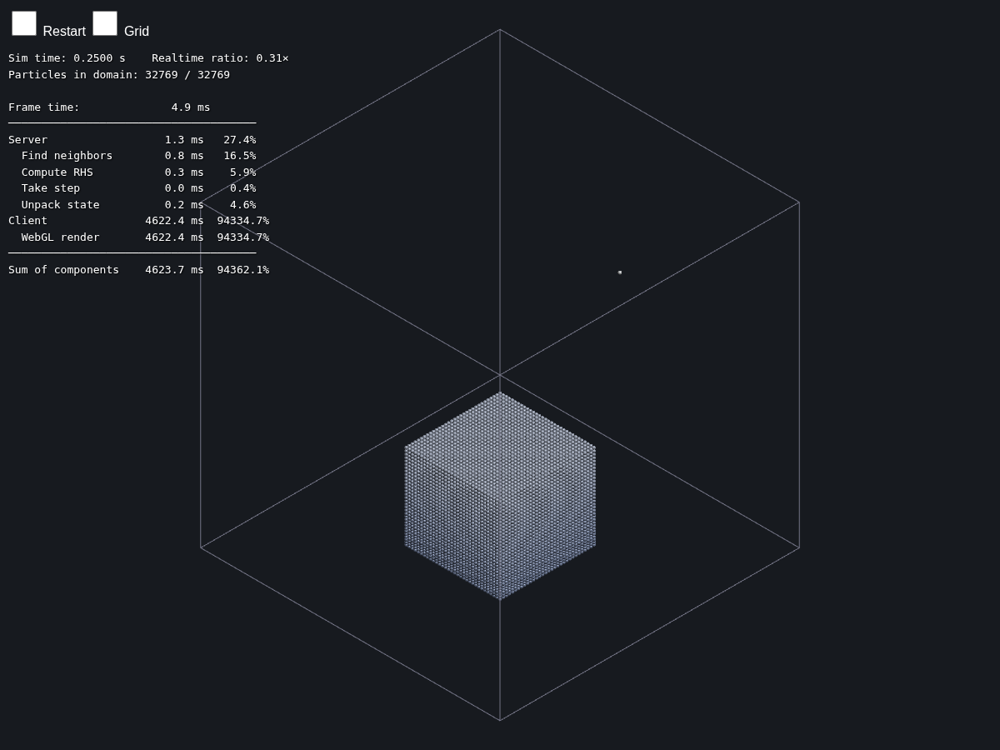
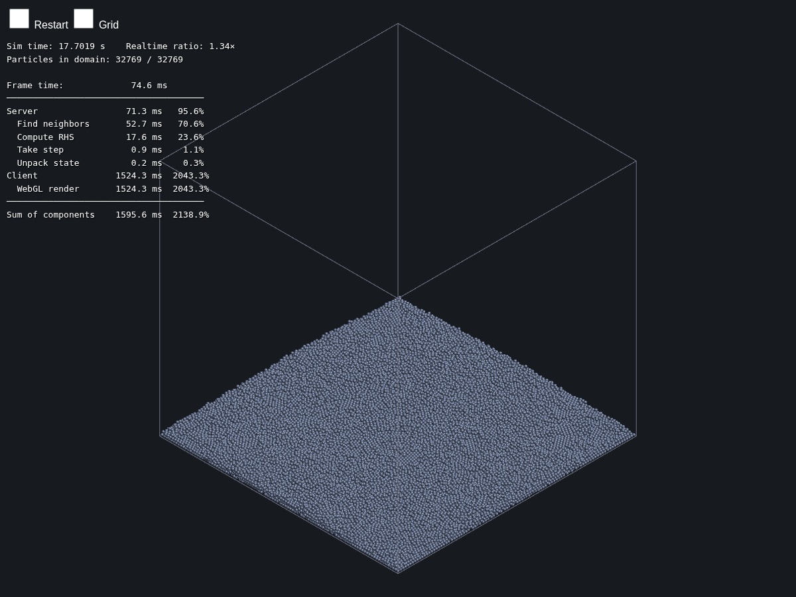
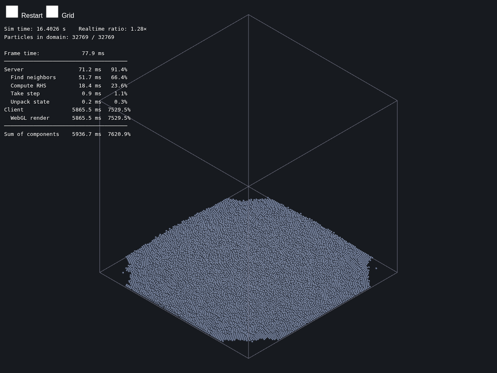

# real-time-particles

**A GPU-native, real-time, interactive physics environment for embodied AI — and a
measurement of what is actually predictable inside it.**

A CUDA discrete-element (DEM) solver simulates granular material in 3D at faster than real time,
streams full particle state over a WebSocket, and renders it in the browser in WebGL2. Every quantity a learned world model would have
to hallucinate — position, velocity, contact force, momentum, energy — exists here exactly
and for free.

<div align="center">
  
</div>

<p align="center"><em>32,768 grains, live in the browser. Each is one instanced quad with the sphere
reconstructed in the fragment shader. HUD shows per-kernel timings and the real-time ratio.</em></p>

<div align="center">
  
  
</div>

<p align="center"><em>Why friction is not optional. Left: frictionless, the pile has no yield stress
and spreads until flat. Right: the same release with μ=0.5, settling into a heap that holds a
slope.</em></p>

---

## Why this exists

Generative world models — Genie, Cosmos, Oasis — have generality and appearance realism
and conserve nothing. They hallucinate, objects morph and vanish, and there is no ground
truth to score them against. Classical simulators have the opposite profile: exact physics,
full controllability, and no generality.

This repository is the exact-simulation side of that trade, built to be usable *as* an
environment rather than as a demo:

|  | this simulator | generative world models |
|---|---|---|
| **Correctness** | exact by construction; momentum conserved, energy tracked | no conservation; objects morph and vanish |
| **Long horizon** | stable indefinitely, and the stability envelope is *mapped* | measured in minutes |
| **Ground-truth state** | full `(x, y, z, vx, vy, vz)`, forces, contacts, energy | pixels only |
| **Intervention** | arbitrary — move a wall, change gravity or restitution mid-run | prompt-level only |
| **Determinism** | reproducible, resettable to any state | stochastic, no reset |
| **Compute** | one GPU, no dataset, no pretraining | thousands of GPU-hours + a data pipeline |
| **Debuggability** | you can point at the kernel that is wrong | the loss went down and the behavior is still wrong |

The bet is that **throughput and exactness beat differentiability for chaotic,
contact-rich systems** — that a world model of granular material does not need to predict
every grain, only what an agent needs in order to decide.

Granular media is the interesting test case because it is both chaotic and non-smooth. That
makes per-grain prediction hopeless and *bulk* prediction perfectly well-posed, and the
difference between those two statements is measurable rather than rhetorical. Measuring it
is the current work (see [Roadmap](#roadmap)).

## What is actually here

**Solver.** ~2,700 lines of C++/CUDA. Five kernels, all deriving from a common `Kernel`
base that handles launch configuration, CUDA-event timing, and error checking:

- **Neighbor search** — a dense collision grid with a compaction pass:
  `atomicCAS` mark → `atomicAdd` compact → slotted fill → 3×3×3 stencil gather. Neighbor
  storage is **O(n·k), not O(cells·k)**, and cell overflow degrades gracefully (excess
  particles are dropped from one step's neighbor search) with a lifetime counter polled off
  the hot path, so detection costs no per-step host synchronization.
- **Contact forces** — a linear spring–dashpot model (Cundall & Strack 1979) with **Coulomb
  friction**. The dashpot coefficient is not a free parameter: it is *derived* from a target
  coefficient of restitution via the standard DEM relation (Tsuji, Tanaka & Ishida 1992), using
  the two-body reduced mass for grain–grain contacts and the infinite-mass limit for walls, and it
  acts on the normal component of the relative velocity only. The tangential force is capped at
  `mu·|F_n|`, which is what gives the material a yield stress and hence an angle of repose.
  Validated against the analytic answer: a grain sliding on the floor decelerates at
  **−4.49 m/s²** versus the ideal **−μg = −4.905**, then stops and stays stopped.
- **Time integration** — semi-implicit Euler, or backward Euler by Picard iteration.
- **Energy** — kinetic + potential by atomic reduction, for drift diagnostics.

**Verification.** A `dt × max_force × restitution` stability sweep with `fork()`+`execl()`
process isolation per combination, so a diverging run cannot take down the sweep;
steady-state detection by a max-acceleration cutoff; automated gnuplot stability maps. Plus
a full-history model-problem driver for single collisions and a GoogleTest suite. Kernel
changes are validated under `compute-sanitizer` (`memcheck` / `racecheck` / `initcheck`).

**Streaming and rendering.** uWebSockets server → binary wire protocol → WebGL2 client, with a
transform driven by the server's actual domain bounds and a live HUD showing simulated time,
real-time ratio, per-kernel milliseconds, frame budget breakdown, and in-domain particle count.
Particles are drawn as impostor spheres — one instanced camera-facing quad each, with the sphere
reconstructed and depth-corrected in the fragment shader — under a fixed isometric orthographic
camera. Verified headlessly end-to-end (Chrome + SwiftShader) at **1.27-1.32x real time** through
the complete loop.

## Performance

The design point is **real time as a hard constraint** — the interesting number is not how
many particles fit in memory but how many can be stepped at 1 s sim = 1 s wall, because
that is what makes the thing an environment instead of a batch job.

**32,768 grains in 3D at 2.06× real time** on a single GeForce RTX 2080 (TU104, 8 GB), `dt = 1e-3`,
0.486 ms/step. Through the full server path — device→host unpack plus WebSocket streaming — the same
configuration measures **1.86× real time**. Per-kernel breakdown over 100 steps:

| stage | ms / 100 steps | share |
|---|---|---|
| neighbor search | 35.1 | 71% |
| contact forces (RHS) | 13.0 | 26% |
| time integration | 1.0 | 2% |
| state unpack (per frame) | 0.23 | — |

Holding real time fixed rather than the particle count is deliberate: an environment you can act in
has to keep up with the actor. Trading that away, the same solver reaches 343,000 grains at 0.12×
real time.

Reproduce with:
```
make profile && ./build/bin/profile   # per-kernel timings for the config in config.yaml
```

Two performance results worth stating on their own, because they are the kind of thing that only
shows up if you measure:

- Raising `particles_per_cell` from 8 to 512 — a change that leaves correctness and actual neighbor
  counts *identical* — roughly **doubled** neighbor-search and RHS time. The cause is row-stride
  growth in the fixed-width neighbor array pushing adjacent particles' rows apart in memory and
  breaking warp-level coalescing. Padding a capacity parameter "to be safe" cost 2× throughput for
  nothing.
- Scaling in 3D is **superlinear**: 4.6× the grains (19.7k → 91k) costs 12.6× the time, because the
  neighbor array is `n × 27 × particles_per_cell` ints and blows past the 2080's 4 MB L2. The
  bottleneck is memory traffic, not arithmetic — which is where the next optimization belongs.

## Build and run

**Backend** (requires CUDA and an NVIDIA GPU):

```
make                  # deps + build/bin/world, the WebSocket sim server
./build/bin/world     # listens on :8081, reads config.yaml
```

`make` auto-detects `CUDA_HOME` and GPU architecture and auto-clones missing dependencies
(GLFW, GoogleTest, uWebSockets) into `external/`. Other targets: `make profile` (no-network
profiling binary), `make stability` (the dt × force sweep), `make model_problem`
(full-history single-run driver), `make test`.

**Client** (no build step):

```
cd client && npm install && node index.js local
```

Then open `http://localhost:8080`.

**Configuration.** Every tunable — timestep, grid sizes, gravity, particle radius, contact
stiffness, restitution, domain bounds, per-material masses, initial geometry, integrator
choice, sweep axes — lives in `config.yaml` and is read by a small dependency-free YAML
loader. Nothing physical is hardcoded, which is what makes counterfactuals ("same scene,
restitution 0.3") a config edit rather than a code change.

## Limits — stated up front

1. **No perception.** Particles render as simple untextured geometry. The appearance gap to a
   real camera is not small, it is total.
2. **Worlds are hand-authored** in `config.yaml`. This is the real objection to a simulator
   as a world model: the economic argument for generative world models is removing exactly
   this authoring bottleneck.
3. **Not differentiable — deliberately.** For dense granular flow the pathwise gradient has
   variance growing like `e^{λT}`, and the contact model is non-smooth independently of the
   chaos (the dashpot switches on discontinuously and the force clamp zeroes the derivative
   exactly). Statistical observables are the differentiable objects here, not trajectories;
   zeroth-order estimation over parallel rollouts is the intended route.
4. **Cannot absorb real data.** Restitution is a number you type, not a quantity inferred
   from observation.
5. **Stiffness-limited timestep.** The stability sweeps map the boundary. Scaling stiffness
   or particle count pushes `dt` down and the real-time budget collapses; this is the wall
   between today's grain counts and 1M+.
6. **Single GPU.** No multi-GPU domain decomposition, and the neighbor array's memory traffic
   (see above) binds before compute does.
7. **A documented fidelity caveat.** When an impact is energetic enough to hit the
   `max_force` clamp, achieved restitution comes out measurably *below* the target, because
   the contact spends time in a constant-force regime the restitution-to-damping derivation
   does not model. Verified against `model_problems/first_collision.yaml`.
8. **No rolling resistance, so the angle of repose is too shallow.** Sliding friction is
   modeled, but spheres roll freely, so heaps settle at roughly 15° where real sand sits near
   30°. This is the standard monodisperse-sphere DEM shortfall and rolling friction is the fix.
   Friction itself is also *regularized* — a viscous tangential force capped at the Coulomb
   limit rather than a true set-valued constraint, because the neighbor list is rebuilt every
   step so no per-contact tangential history survives to integrate. In practice it holds
   statically (verified above), but it is sliding friction without a true static threshold.

## Roadmap

Current work, in order:

1. ~~**3D physics** — `[x, y, z, vx, vy, vz]`, z up, 3×3×3 neighbor stencil.~~ **Done.** All five
   drivers, the wire protocol and the test suite are 3D; all three sanitizers clean.
2. ~~**Isometric sphere rendering** — fixed orthographic camera, impostor spheres with
   analytic depth and Lambert shading.~~ **Done.** One instanced quad per grain, sphere
   reconstructed in the fragment shader with analytic `gl_FragDepth`. Screenshots in
   `assets/screenshots/`.
3. **A density-grid latent.** Trilinear (cloud-in-cell) mass deposit onto a coarse grid —
   the same particle-to-grid transfer MPM uses — plus mass-weighted momentum channels. The
   pair is a closed-form, mass-conserving **encoder** (deposit) and **decoder** (sample
   grains back out of the field), so the latent is cheap to move in and out of physical
   space in both directions.
4. **An action-conditioned surrogate.** Predict the outcome density field from the throw
   parameters — POD reduction plus Gaussian-process regression per mode, which also yields
   calibrated predictive uncertainty and a free parameter-sensitivity ranking from the ARD
   lengthscales. Then the harder version: predict the *next* latent from the current one and
   roll it out.
5. **The predictability horizon.** Perturb initial conditions by ε and measure two
   divergences against time: per-grain (grows like `e^{λt}`) and bulk-statistic (bounded).
   That measurement is the point — it says precisely what a world model of a chaotic system
   can and cannot know, and it turns the surrogate's design into a consequence of a
   measurement instead of a preference.

Further out: Gaussian-splat rendering (3D Gaussian splatting is a particle representation,
so a DEM/MPM backend attaches to it directly), XPBD or implicit contact to break the
stiffness–timestep wall, multi-GPU decomposition, and adaptive resolution.

## References

- Cundall & Strack, *A discrete numerical model for granular assemblies*, Géotechnique 29(1), 1979
- Tsuji, Tanaka & Ishida, *Lagrangian numerical simulation of plug flow of cohesionless particles in a horizontal pipe*, Powder Technology 71(3), 1992
- Di Renzo & Di Maio, *Comparison of contact-force models for the simulation of collisions in DEM-based granular flow codes*, Chem. Eng. Sci. 59(3), 2004
- Metz et al., *Gradients Are Not All You Need*, 2021
- Suh, Simchowitz, Zhang & Tedrake, *Do Differentiable Simulators Give Better Policy Gradients?*, ICML 2022
- Higdon et al., *Computer model calibration using high-dimensional output*, JASA 103(482), 2008
